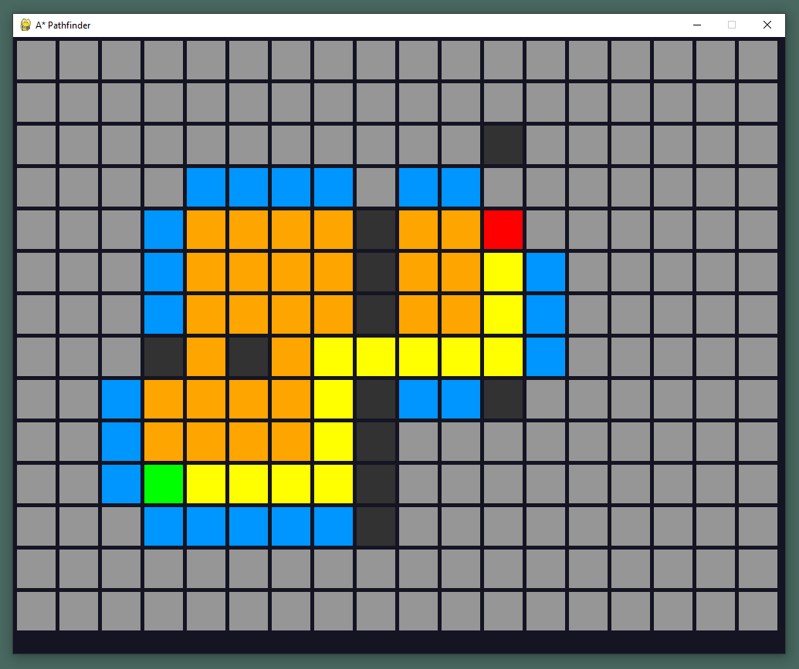

# A* Algorithm (Traditional AI for games)

This is meant to be a practice and study on the technique for pathfinding. It's implemented using Pygame since it's a two dimensional grid containing nodes.
The idea is to have a grid containing nodes, and be able to select a **Start Node**, and **End Node**; as well as obstacles that will be excluded in the process of calculating the path from **Start node** to **End node**.

For calculating the distance between the two points in this grid-based system, I'll use the *Manhattan Distance* formula:
**|X1 - X2| + |Y1 - Y2|**

## Screenshot Preview

Currently the program lets you select start node (*green node*), end node (*red node*) and non-walkable nodes (*dark-grey nodes*).
The discarted nodes are displayed in **Blue**, the considered nodes are displayed in **Orange**, and the actual path is displayed in **Yellow**.
