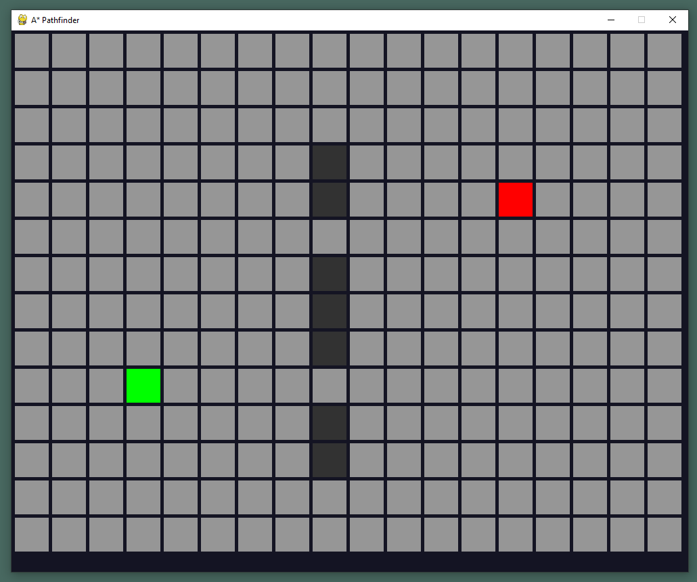

# A* Algorithm (Traditional AI for games)

This is meant to be a practice and study on the technique for pathfinding. It's implemented using Pygame since it's a two dimensional grid containing nodes.
The idea is to have a grid containing nodes (light grey squares), and be able to select a **Start Node** (currently green), and **End Node** (currently red); as well as obstacles (dark grey nodes) that will be excluded in the process of calculating the path from **start node** to **end node**. The path would be a list of nodes (displayed as light blue).

## Screenshot Preview

Currently the program lets you select start node, end node and non-walkable nodes.
The core A* algorithm is yet to be developed.
